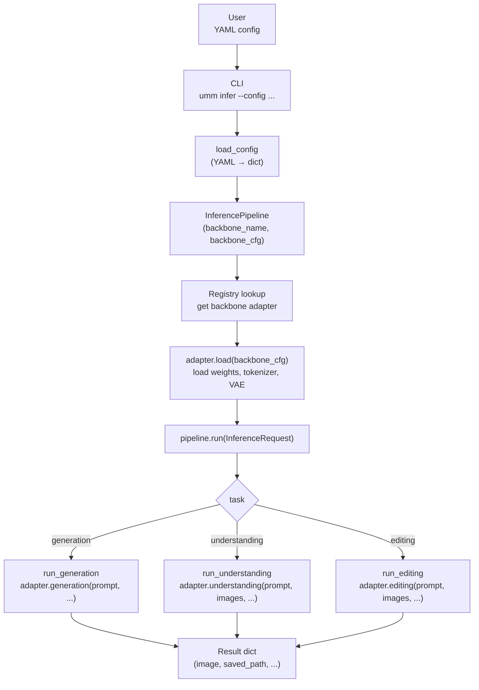
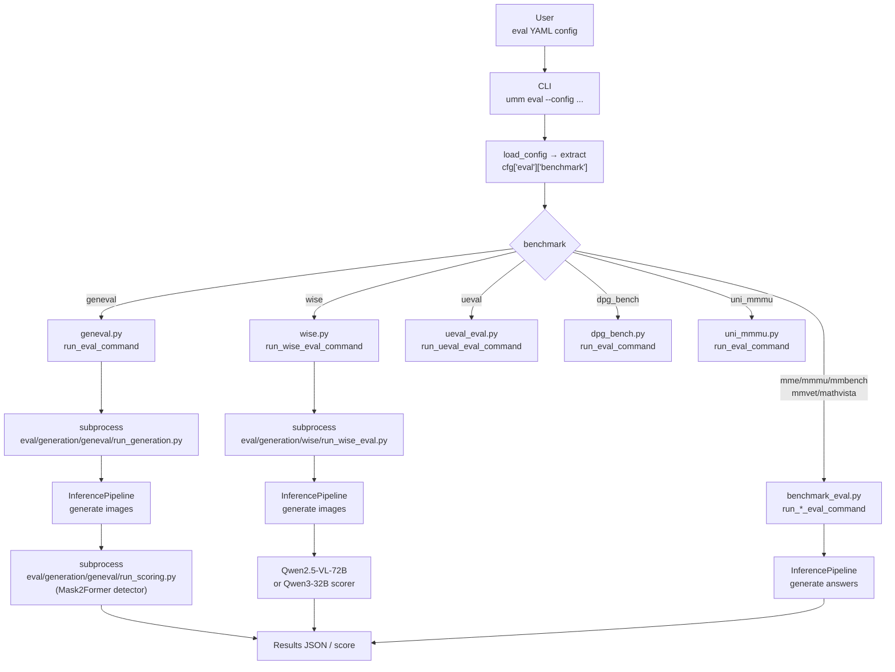
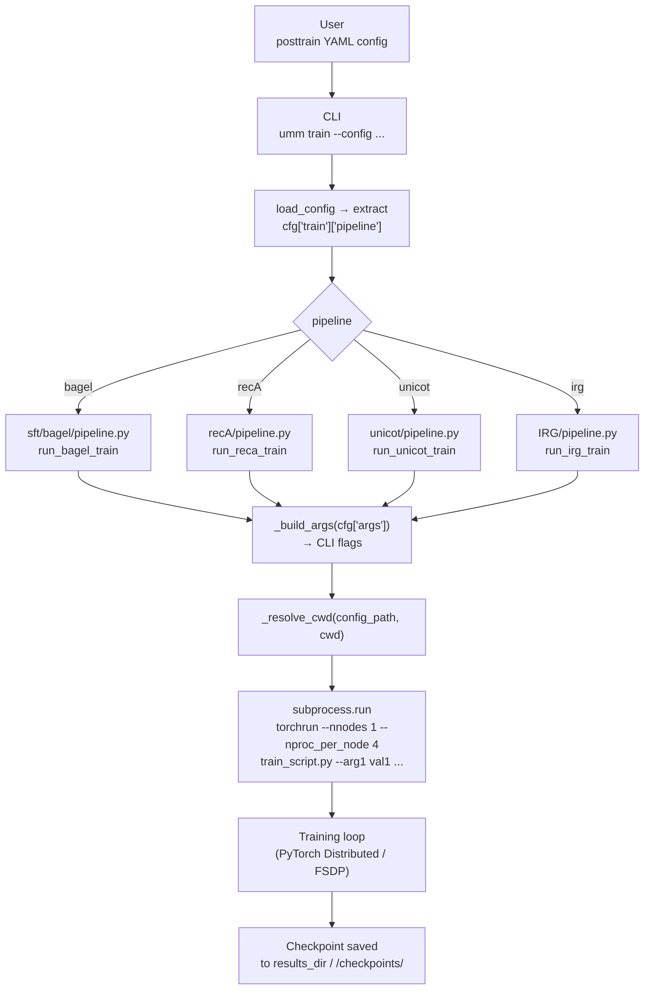

# Architecture

This page describes the internal design of TorchUMM — how inference, evaluation, and post-training pipelines are structured, how backbone adapters plug in, and how the codebase is organized.

---

## Inference Pipeline

### Overview

The inference pipeline follows a strict layered design: the CLI reads a YAML config, instantiates `InferencePipeline` with the chosen backbone, and dispatches the request to the correct task runner.



### Key Classes

| Class | File | Role |
| :--- | :--- | :--- |
| `InferencePipeline` | `src/umm/inference/pipeline.py` | Entry point; builds backbone from registry, dispatches tasks |
| `InferenceRequest` | `src/umm/inference/multimodal_inputs.py` | Typed dataclass: `backbone`, `task`, `prompt`, `images`, `params` |
| `BackboneAdapter` | `src/umm/core/interfaces.py` | Protocol that all backbone adapters must implement |
| `Registry` | `src/umm/core/registry.py` | Simple dict-based registry for backbones, evaluators, trainers |

### InferenceRequest Fields

```python
@dataclass
class InferenceRequest:
    backbone: str                    # e.g. "bagel", "janus_pro", "janus_flow"
    task: str                        # "generation" | "understanding" | "editing"
    prompt: str | None = None
    images: list[str] = field(...)   # local file paths
    videos: list[str] = field(...)   # reserved for future use
    params: dict = field(...)        # task-specific overrides
    metadata: dict = field(...)
    output_path: str | None = None
```

**Validation rules:**

- `generation` — requires `prompt`
- `editing` — requires `prompt` AND at least one image
- `understanding` — requires at least one of `prompt` or `images`

---

## Evaluation Pipeline

### Overview

Evaluation follows a two-level dispatch: the top-level CLI routes to a benchmark-specific handler, which then calls an `InferencePipeline` internally and runs scoring.



### Two-Stage vs Single-Stage Benchmarks

| Type | Benchmarks | Stage 1 | Stage 2 |
| :--- | :--- | :--- | :--- |
| **Two-stage** | GenEval, WISE, UEval, Uni-MMMU | Generate images/text | Score with detector or Qwen VLM |
| **Single-stage** | MME, MMMU, MMBench, MM-Vet, MathVista, DPG Bench | Generate + score in one pass | — |

For two-stage benchmarks, separate `_generate` and `_score` configs are provided. The full-pipeline config (e.g., `geneval_bagel.yaml`) runs both stages automatically.

### Scoring Models

| Benchmark | Scorer |
| :--- | :--- |
| GenEval | Mask2Former object detector |
| WISE | Qwen2.5-VL-72B-Instruct (local, from `/model_cache/evaluator/`) |
| UEval | Qwen series models (local) |
| Uni-MMMU | Qwen3-32B (local) |
| MME / MMMU / MMBench / MM-Vet / MathVista | Rule-based or model-specific scoring |

---

## Post-Training Pipeline

### Overview

Post-training configs specify a `pipeline` name that selects the training dispatcher. All dispatchers follow the same pattern: build a `torchrun` or `python` subprocess and execute the training script inside the model repo.



### Supported Training Methods

| Method | Pipeline key | Training approach | Multi-GPU |
| :--- | :--- | :--- | :--- |
| **SFT** | `bagel` | Full fine-tuning on Bagel base | torchrun (4 GPU) |
| **IRG** | `irg` | 2-stage interleaved reasoning generation | torchrun (4 GPU) |
| **recA** | `recA` | Reconstruction alignment | torchrun |
| **UniCot** | `unicot` | Chain-of-thought training via LoRA (rank=256) | torchrun (4 GPU) |

### Post-Train Model Serving

After training, model weights land in `/checkpoints/` (local) or `umm-checkpoints` volume (Modal). For evaluation, copy weights to `umm-post-train-model-cache` and supplement with the base model's config files:

```bash
# 1. Check the weights are there
modal volume ls umm-post-train-model-cache post_train/<variant>/

# 2. Copy config/tokenizer/VAE files from base BAGEL
modal run modal/copy_bagel_files.py --target <variant>

# 3. Run evaluation on the post-trained variant
modal run modal/run.py --model bagel \
    --eval-config modal_geneval_bagel_<variant>_score --gpu H100
```

---

## Task-Level Support Matrix

| Model | Understand | Generate | Edit | Benchmarks |
| :--- | :---: | :---: | :---: | :--- |
| **Bagel** | Yes | Yes | Yes | DPG, GenEval, WISE, UEval, Uni-MMMU, MME, MMMU, MMBench, MM-Vet, MathVista |
| **OmniGen2** | Yes | Yes | Yes | DPG, GenEval, WISE, UEval, Uni-MMMU, MME, MMMU, MMBench, MM-Vet, MathVista |
| **Emu3** | Yes | Yes | No | DPG, GenEval, WISE, UEval, Uni-MMMU, MME, MMMU, MMBench, MM-Vet, MathVista |
| **Janus-Pro** | Yes | Yes | No | DPG, GenEval, WISE, UEval, Uni-MMMU, MME, MMMU, MMBench, MM-Vet, MathVista |
| **JanusFlow** | Yes | Yes | No | DPG, GenEval, WISE, Uni-MMMU |
| **Show-o2** | Yes | Yes | No | DPG, GenEval, WISE, UEval, Uni-MMMU, MME, MMMU, MMBench, MM-Vet, MathVista |
| **BLIP3-o** | No | Yes | No | DPG, GenEval, WISE, UEval |
| **TokenFlow** | No | Yes | No | DPG, GenEval, WISE, UEval |

### Backbone Adapter Design Notes

When implementing a new backbone adapter, keep these lessons in mind (learned from integrating models like OmniGen2):

1. **Exception propagation in `editing()`.** The evaluation pipeline uses a try/except to fall back from editing to text-to-image generation when editing is unsupported or fails. If your `editing()` method catches exceptions internally and returns an error dict, the caller cannot distinguish it from a successful result and the fallback is silently skipped. **Let pipeline exceptions propagate.** Only the final `generation()` method should catch and wrap errors.

2. **Shared model components.** If your model uses separate pipeline objects for different tasks (e.g., OmniGen2 uses `OmniGen2Pipeline` for generation/editing and `OmniGen2ChatPipeline` for understanding), construct one pipeline first, then build the other from shared component references. Loading both via `from_pretrained` duplicates all model weights in GPU memory.

3. **Task-appropriate system prompts.** Unified models that support both generation and understanding often have a default system prompt biased toward one capability. For example, OmniGen2's chat pipeline uses `"generates high-quality images"` as its system prompt, which causes the model to emit image generation tokens (`<|img|>`) instead of text reasoning when given complex prompts. Override the system prompt to match the task — use a text-analysis prompt for understanding, and the default prompt for generation.

### Inference Implementation Strategy

| Model | Generation approach | Understanding approach |
| :--- | :--- | :--- |
| **Bagel** | Diffusion (MoT) with VAE, CFG text+image scale | Native VLM head |
| **OmniGen2** | `OmniGen2Pipeline` (flow matching) | `OmniGen2ChatPipeline` (separate) |
| **Emu3** | VQ-tokenizer autoregressive (Emu3-Gen) | Emu3-Chat (separate model) |
| **Janus-Pro** | Parallel generation (4 images per pass, CFG) | VLChatProcessor-based |
| **JanusFlow** | Rectified flow ODE (30 steps, SDXL VAE decode) | VLChatProcessor-based |
| **Show-o2** | Subprocess (wraps Show-o scripts) | Subprocess (wraps Show-o scripts) |
| **BLIP3-o** | Subprocess (wraps BLIP3-o scripts) | — |
| **TokenFlow** | Subprocess (wraps TokenFlow scripts) | — |

---

## Codebase Map

```
umm_codebase/
│
├── src/umm/                          # Core Python package
│   ├── cli/                          # Command-line entry points
│   │   ├── main.py                   # Argument parser, subcommand registration
│   │   ├── infer.py                  # `umm infer` handler
│   │   ├── eval.py                   # `umm eval` dispatcher → benchmark handlers
│   │   ├── train.py                  # `umm train` dispatcher → pipeline handlers
│   │   ├── geneval.py                # GenEval benchmark runner
│   │   ├── wise.py                   # WISE benchmark runner
│   │   ├── ueval_eval.py             # UEval benchmark runner
│   │   ├── dpg_bench.py              # DPG Bench runner
│   │   ├── uni_mmmu.py               # Uni-MMMU runner
│   │   ├── mme_eval.py               # MME runner
│   │   ├── mmmu_eval.py              # MMMU runner
│   │   ├── mmbench_eval.py           # MMBench runner
│   │   ├── mmvet_eval.py             # MM-Vet runner
│   │   └── mathvista_eval.py         # MathVista runner
│   │
│   ├── inference/                    # Inference pipeline
│   │   ├── pipeline.py               # InferencePipeline class
│   │   ├── generation.py             # run_generation/editing/understanding
│   │   ├── multimodal_inputs.py      # InferenceRequest dataclass, validators
│   │   └── batcher.py                # batch_iter utility
│   │
│   ├── backbones/                    # Model adapters (one per model)
│   │   ├── bagel/
│   │   │   ├── adapter.py            # BagelBackbone
│   │   │   └── Bagel/                # git submodule (original repo)
│   │   ├── omnigen2/
│   │   │   ├── adapter.py            # OmniGen2Backbone
│   │   │   └── OmniGen2/
│   │   ├── emu3/
│   │   │   ├── adapter.py            # Emu3Backbone (Chat + Gen + VQ)
│   │   │   └── Emu3/
│   │   ├── janus_pro/
│   │   │   ├── adapter.py            # JanusProBackbone
│   │   │   └── Janus/
│   │   ├── janus_flow/
│   │   │   ├── adapter.py            # JanusFlowBackbone (rectified flow + SDXL VAE)
│   │   │   └── Janus/
│   │   ├── show_o/
│   │   │   ├── adapter.py            # ShowOBackbone (subprocess)
│   │   │   └── Show-o/
│   │   ├── blip3o/
│   │   │   ├── adapter.py            # Blip3oBackbone (subprocess)
│   │   │   └── BLIP3o/
│   │   └── tokenflow/
│   │       ├── adapter.py            # TokenFlowBackbone (subprocess)
│   │       └── TokenFlow/
│   │
│   ├── post_training/                # Training pipelines
│   │   ├── sft/bagel/pipeline.py     # run_bagel_train (pipeline: bagel)
│   │   ├── recA/pipeline.py          # run_reca_train  (pipeline: recA)
│   │   ├── unicot/pipeline.py        # run_unicot_train (pipeline: unicot)
│   │   └── IRG/pipeline.py           # run_irg_train   (pipeline: irg)
│   │
│   └── core/                         # Shared utilities
│       ├── registry.py               # register() / get() for backbones/evaluators
│       ├── interfaces.py             # BackboneAdapter protocol
│       ├── config.py                 # load_config (YAML/JSON → dict)
│       ├── io.py                     # I/O helpers
│       └── runtime.py                # Runtime utilities
│
├── configs/                          # All YAML configuration files
│   ├── inference/                    # Inference configs per model
│   │   ├── modal_bagel_generation.yaml
│   │   ├── modal_bagel_understanding.yaml
│   │   ├── modal_bagel_editing.yaml
│   │   ├── emu3_generation.yaml
│   │   ├── omnigen2_generation.yaml
│   │   ├── show_o2_generation.yaml
│   │   ├── tokenflow_generation.yaml
│   │   └── ...
│   ├── eval/                         # Eval configs per benchmark per model
│   │   ├── dpg_bench/
│   │   ├── geneval/
│   │   ├── wise/
│   │   ├── ueval/
│   │   ├── uni_mmmu/
│   │   ├── mme/
│   │   ├── mmmu/
│   │   ├── mmbench/
│   │   ├── mmvet/
│   │   └── mathvista/
│   └── posttrain/                    # Training configs
│       ├── bagel_sft.yaml
│       ├── irg_stage1.yaml
│       ├── irg_stage2.yaml
│       ├── recA.yaml
│       └── unicot.yaml
│
├── eval/                             # Evaluation scripts (called by CLI as subprocesses)
│   ├── generation/
│   │   ├── geneval/
│   │   ├── wise/
│   │   ├── dpg_bench/
│   │   ├── ueval/
│   │   └── uni_mmmu/
│   └── vlm/                          # Understanding benchmark scripts
│
├── modal/                            # Modal cloud infrastructure
│   ├── config.py                     # Volume names, HF model paths
│   ├── volumes.py                    # Volume definitions
│   ├── images.py                     # Docker images per model
│   ├── run.py                        # Modal inference + eval runner
│   ├── train.py                      # Modal training runner
│   └── download.py                   # Download weights/datasets to volumes
│
├── data/                             # Local benchmark data
│   ├── mme/
│   ├── mmbench/
│   ├── mmvet/
│   ├── mathvista/
│   └── ...
│
└── model/                            # Git submodules (DO NOT MODIFY)
    ├── Bagel/
    ├── OmniGen2/
    ├── Emu3/
    ├── Janus/
    ├── Show-o/
    ├── BLIP3o/
    ├── TokenFlow/
    ├── geneval/
    ├── WISE/
    └── UEval/
```

---

## Backbone Adapter Pattern

All backbone adapters implement the same interface, making them interchangeable from the pipeline's perspective:

```python
class BackboneAdapter(Protocol):
    name: str

    def load(self, cfg: dict) -> None:
        """Load model weights, tokenizer, VAE etc. from cfg."""
        ...

    def generation(self, prompt: str, output_path: str, **cfg) -> dict:
        """Text-to-image generation. Returns dict with 'image' key."""
        ...

    def understanding(self, prompt: str, images: list[str], **cfg) -> dict:
        """VQA / captioning. Returns dict with 'text' key."""
        ...

    def editing(self, prompt: str, images: list[str], output_path: str, **cfg) -> dict:
        """Image editing. Returns dict with 'image' key."""
        ...
```

New models are registered via:

```python
# src/umm/inference/pipeline.py
from umm.core.registry import register

register("backbone", "my_model", MyModelBackbone)
```

---

## Config File Naming Conventions

| Context | Pattern | Example |
| :--- | :--- | :--- |
| Local inference | `<model>_<task>.yaml` | `emu3_generation.yaml` |
| Modal inference | `modal_<model>_<task>.yaml` | `modal_bagel_generation.yaml` |
| Local eval (full) | `<benchmark>_<model>.yaml` | `geneval_bagel.yaml` |
| Local eval (generate only) | `<benchmark>_<model>_generate.yaml` | `geneval_bagel_generate.yaml` |
| Local eval (score only) | `<benchmark>_<model>_score.yaml` | `geneval_bagel_score.yaml` |
| Modal eval | `modal_<benchmark>_<model>.yaml` | `modal_geneval_bagel.yaml` |
| Post-training | `<method>.yaml` or `<model>_<method>.yaml` | `bagel_sft.yaml`, `recA.yaml` |
